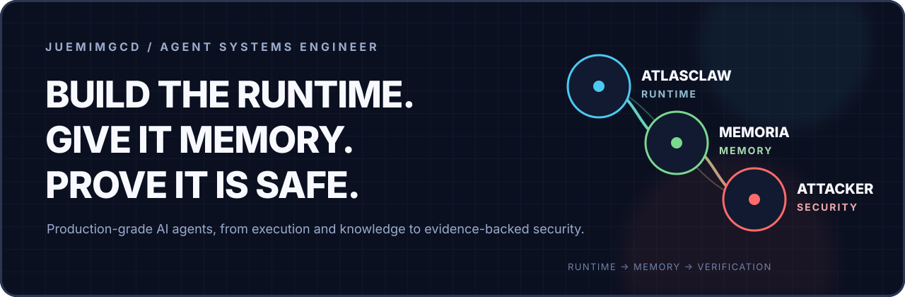

<p align="center">
  
</p>

<p align="center">
  <a href="./README.md">简体中文</a>
  ·
  <a href="./README.zh-TW.md">繁體中文</a>
  ·
  <a href="./README.en.md">English</a>
  ·
  <a href="./README.ja.md">日本語</a>
  ·
  <strong>Français</strong>
</p>

<h1 align="center">Bonjour, je suis Juemimgcd 👋</h1>

<h3 align="center">Je ne construis pas de simples démos conversationnelles, mais des systèmes d'Agents durables, récupérables et auditables.</h3>

<p align="center">
  Agent Runtime · Long-term Memory · RAG · Multi-Agent · AI Security · Production Engineering
</p>

<p align="center">
  <a href="https://github.com/juemimgcd">GitHub</a>
  ·
  <a href="https://blog.csdn.net/2403_88183496">CSDN</a>
  ·
  <a href="mailto:15551285402@163.com">Email</a>
</p>

---

## Une même vision d'ingénierie, pas trois dépôts sans rapport

Je conçois un Agent comme un véritable système logiciel. Le modèle n'est qu'un composant de décision ; ce sont le runtime, l'état, la propriété des données, les permissions, les preuves, la reprise et les frontières de sécurité qui déterminent si le système peut réellement passer en production.

<table>
  <tr>
    <td width="33%" valign="top">
      <strong>⚙️ Runtime / Integration</strong><br/><br/>
      Connecter les Agents aux systèmes d'entreprise via Skills, Tools, Providers, Sessions et Workflows, tout en conservant les permissions réelles de l'utilisateur.
    </td>
    <td width="33%" valign="top">
      <strong>🧠 Memory / Intelligence</strong><br/><br/>
      Construire une mémoire long terme consultable, gouvernable et récupérable, cohérente entre conversations et tâches asynchrones.
    </td>
    <td width="33%" valign="top">
      <strong>🛡️ Security / Verification</strong><br/><br/>
      Prouver, par des politiques déterministes, des cas d'attaque, des Evidence et le Replay, qu'un Agent n'a pas outrepassé ses droits, divulgué de données, pollué l'état ou contourné une approbation.
    </td>
  </tr>
</table>

```text
AtlasClaw  →  Runtime d'Agent et intégration aux systèmes d'entreprise
Memoria    →  Mémoire long terme, gouvernance des connaissances et exécution durable
Attacker   →  Évaluation offensive, traçabilité des preuves et vérification de sécurité
```

---

## 01 / AtlasClaw

### [Enterprise Agent Framework for multi-system integration](https://github.com/CloudChef/atlasclaw)

> Un point d'entrée conversationnel sécurisé permettant aux employés d'interroger des données, de déclencher des workflows et d'agir sur plusieurs systèmes existants.

| Mon rôle | Positionnement | Modes d'exécution | Liens |
|---|---|---|---|
| Open-source Contributor | Enterprise Agent Framework | Embedded / Standalone | [Repository](https://github.com/CloudChef/atlasclaw) · [Website](https://atlasclaw.ai/en/) |

Les logiciels d'entreprise sont répartis entre CRM, ITSM, supervision, RH, finance et bureautique. La difficulté n'est pas d'appeler une API supplémentaire, mais de respecter des modèles de données, identités, permissions, règles d'audit et frontières de workflow différents.

```text
Web UI / Embedded Panel / Chat Platform / Webhook
                         ↓
              API & Channel Adapters
                         ↓
        Session · Memory · Agent Engine · Workflow
                         ↓
             Skills · Tools · Provider Registry
                         ↓
       CRM · ITSM · Monitoring · HR · Finance · OA
```

### Mes axes de contribution

- **Thin Core + Rich Providers** : conserver dans le Core uniquement le runtime générique ; laisser l'authentification, les compétences métier et les scripts système dans les Providers.
- **Des capacités métier pilotées par les Skills** : décrire les scénarios, limites de décision et usages d'outils afin que le modèle agisse dans un périmètre explicite.
- **Des interfaces unifiées** : REST, SSE, WebSocket et Webhook servent les conversations humaines, les Agents intégrés et l'automatisation programmée.
- **L'héritage des permissions réelles** : les actions utilisent les droits de l'utilisateur authentifié dans le système cible, sans contourner le RBAC ni masquer l'audit.
- **Des couches remplaçables** : les Providers de modèles, Providers d'entreprise, Tools et Skills peuvent évoluer indépendamment.

AtlasClaw m'a fait passer de la réalisation d'une fonctionnalité d'Agent à la conception d'une infrastructure réutilisable : propagation d'identité, contrôle des permissions, continuité de session, enregistrement d'outils, exposition des échecs et intégration économique de nouveaux systèmes.

**Core Stack**

`Python` `FastAPI` `Pydantic AI` `Provider Registry` `Skills` `Tools` `Workflow` `SSE` `WebSocket`

---

## 02 / Memoria

### [A durable memory and knowledge system for personal AI](https://github.com/juemimgcd/Reminder)

> Transformer documents, conversations, expériences et rétrospectives en mémoire long terme consultable, gouvernable et traçable.

| Forme | Cœur du projet | Système en ligne | Liens |
|---|---|---|---|
| Full-stack AI Application | Long-term Memory + RAG + Durable Agent | Mneme / Memoria | [Repository](https://github.com/juemimgcd/Reminder) · [Live](https://www.mneme.com.cn) |

Memoria est le cœur intelligent de Mneme. Ce n'est pas seulement « téléverser un document et poser une question ». Bases de connaissances, documents, chunks, Evidence, candidats mémoire, mémoires canoniques, révisions, relations, profils, rapports de progression et recommandations possèdent tous une propriété et un cycle de vie explicites.

```text
Browser / API
      ↓
Mneme FastAPI ───────────────→ PostgreSQL Durable Run
      │                               ↓
      ├─ Document Pipeline      Redis Session FIFO
      ├─ Outbox / Inbox               ↓
      └─ Task Records            Memoria Agent API
                                      ↓
                     Retrieval · Evidence · Answer
                          ↓          ↓          ↓
                       pgvector   PostgreSQL   Neo4j
```

### Capacités du système

- **Chaîne de connaissances complète** : ingestion, analyse, découpage, indexation, recherche, Rerank, génération et validation des citations dans un flux traçable.
- **Gouvernance de la mémoire long terme** : candidats, mémoire canonique, révisions, relations, barrières de suppression et audit opérationnel protègent qualité et vie privée.
- **Durable Agent Runs** : PostgreSQL conserve les faits d'exécution tandis que Redis coordonne ; baux, reprises, annulation, replay et récupération sont des comportements natifs.
- **Évolution contrôlée des conversations** : `interrupt`, `followup` et `steer` créent des relations Run / Trace explicites sans modifier un Prompt opaque en cours d'exécution.
- **Choix Multi-Agent explicite** : le chemin rapide à un seul Agent reste le défaut ; la collecte parallèle bornée ne démarre que sur choix de l'utilisateur.
- **Raisonnement borné** : périmètre de recherche, Top-K, appels Provider, tokens, coût, échéance et tours supplémentaires sont limités.
- **Livraison événementielle** : Outbox / Inbox, Celery, Heartbeat, approbations, notifications et Dead Letter rendent les effets de bord rejouables et observables.
- **Résilience des modèles et gouvernance du contexte** : modèles principal/de secours, reprises transitoires, Provider Cooldown, compaction bornée et événements publics sans fuite de contenu.
- **Observabilité de production** : corrélation Request / Run / Event, Health, Readiness, métriques Prometheus, alertes et runbooks.

La difficulté centrale d'une mémoire long terme n'est pas la similarité vectorielle. Ce sont la propriété, la provenance, la validité, la suppression, les événements tardifs, les doublons et l'ordre. Memoria traite donc Ownership, Evidence, Idempotency, Ordering, Deletion Fence et Audit comme des concepts métier fondamentaux.

**Core Stack**

`Python` `FastAPI` `Vue 3` `PostgreSQL` `pgvector` `Redis` `Celery` `Neo4j` `BGE-M3` `Docker Compose`

---

## 03 / Attacker

### [Evidence-backed security evaluation for AI Agents](https://github.com/juemimgcd/Attacker)

> Évaluer des Agents dans des environnements isolés et explicitement autorisés, à l'aide d'attaques reproductibles, de politiques déterministes et de preuves durables.

```text
Target + Dataset + Policy
          ↓
     Evaluation Run
          ↓
 Policy Gate / Approval / Budget
          ↓
 Evidence Event → Finding → JSON / Markdown Report
          ↓
 Replay → fixed / new / persistent / regressed
```

### Trois niveaux d'évaluation

| Niveau | Périmètre | Preuves principales |
|---|---|---|
| **Black-box** | Prompt injection, fuite du prompt, données sensibles, pollution du contexte, limites de ressources | Request / Response / Evaluator |
| **Gray-box Agent** | Dépassement d'outil, arguments dangereux, contournement d'approbation, Tool Output Injection, boucles Planner | Tool / Policy / Approval Trace |
| **Stateful Agent** | Pollution Memory / RAG, isolation des identités, reprise Checkpoint, Replay | Memory / Retrieval / Checkpoint Event |

### Priorités d'ingénierie

- **Deterministic Core, Agentic Orchestration** : LangGraph peut proposer l'étape suivante, mais le Core maîtrise Targets, Cases, Tools, approbations, budgets et arrêt.
- **Policy Before Execution** : chaque appel Target ou Tool passe la Policy Gate avant tout effet de bord.
- **Evidence Before Claims** : chaque Finding référence une Evidence persistée ; les rapports sont reconstruits depuis les faits métier, pas le contexte du modèle.
- **Bounded Autonomy** : tentatives Provider, appels, tokens, coût, durée et taille de réponse ont des limites strictes.
- **Safe Recovery** : une reprise de Checkpoint revalide la Policy sans dupliquer appels modèle, appels Target ou Findings.
- **Replay Diff** : comparer des Dataset et Policy fixes selon `fixed`, `new`, `persistent` et `regressed`.
- **Secret Separation** : les identifiants n'entrent jamais dans les événements, rapports, snapshots ou checkpoints.
- **Default-safe Target Policy** : toute cible publique ou non résolue est refusée sans autorisation explicite.

Attacker ne cherche pas à faire réussir une attaque une seule fois. Il rend un résultat de sécurité reproductible, autorisé, étayé par des preuves et comparable après correction.

**Core Stack**

`Python 3.12` `FastAPI` `LangGraph` `Pydantic` `SQLAlchemy Async` `Alembic` `SQLite / PostgreSQL` `pytest` `Pyright`

---

## Les principes communs aux trois projets

| Principe | Mise en pratique |
|---|---|
| **Model proposes, system decides** | Le modèle analyse et propose ; Policy, Schema, budgets et approbations décident ce qui peut s'exécuter. |
| **Durable facts over volatile context** | Les faits en base pilotent reprise et audit ; Redis et Checkpoint coordonnent sans être la vérité finale. |
| **Evidence before confidence** | Réponses, mémoires et Findings doivent revenir à leurs sources, événements et preuves. |
| **Failure is part of the design** | Idempotence, reprises, baux, ordre, annulation, Dead Letter et récupération sont conçus dès le départ. |
| **Security before side effects** | Identité, tenant, permissions, secrets, Target et arguments sont contraints avant exécution. |
| **Production is the whole chain** | API, Worker, Migration, observabilité, CI, conteneurs, déploiement et runbooks font partie du produit. |

## Cartographie technique

| Layer | Technologies | Ce que je construis |
|---|---|---|
| **Agent Runtime** | LangGraph, Pydantic AI, Skills, Tools, Providers | Routage, machines à états, appels d'outils, workflows, approbation, autonomie bornée |
| **RAG & Memory** | BGE-M3, pgvector, Reranker, Neo4j | Recherche, preuves, citations, gouvernance mémoire, profils, relations |
| **Backend** | Python, FastAPI, Pydantic, SQLAlchemy Async, Alembic | Contrats API, modèles métier, transactions, idempotence, frontières de service |
| **Async & Data** | PostgreSQL, Redis, Celery, Outbox / Inbox | Durable Runs, files de tâches, livraison d'événements, reprise, cohérence |
| **Frontend** | TypeScript, Vue 3, React, Vite | Espaces Agent, streaming, état d'exécution, visualisation |
| **Security & Quality** | Policy Gate, Replay, pytest, Ruff, Pyright | Évaluation autorisée, Evidence, analyse statique, tests comportementaux, CI |
| **Delivery** | Docker, Docker Compose, Nginx, GitHub Actions | Orchestration d'environnement, déploiement, santé, supervision, opérations |

## Travaux en cours

- Étendre l'écosystème Provider / Skill et les frontières d'intégration d'AtlasClaw
- Améliorer la gouvernance du contexte, la qualité de mémoire et le raisonnement vérifiable de Memoria
- Développer l'écosystème de sécurité, l'évaluation continue et les fondations de production d'Attacker
- Documenter les problèmes réels rencontrés avec les Agents, le RAG, la conception système et l'évolution des projets

---

<h3 align="center">Build the runtime. Give it memory. Prove it is safe.</h3>

<p align="center">
  Si vous travaillez sur les runtimes d'Agents, la mémoire long terme, le RAG ou l'évaluation de sécurité de l'IA, échangeons.
</p>

<p align="center">
  <a href="https://github.com/juemimgcd">Explorer mes dépôts</a>
  ·
  <a href="https://blog.csdn.net/2403_88183496">Lire mes notes</a>
  ·
  <a href="mailto:15551285402@163.com">Me contacter</a>
</p>
